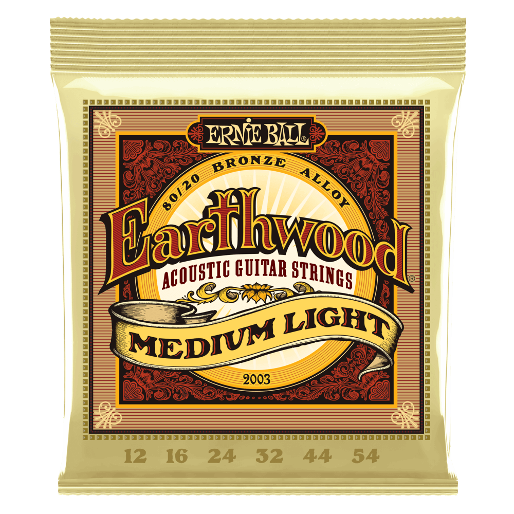

# Acoustic guitar strings
Reviews of steel strings for acoustic guitars

**By Steven Rosenberg**
 <a href="mailto:guitar@passthejoe.net">*guitar@passthejoe.net*</a>

Nov. 23, 2020

## Ernie Ball Earthwood Acoustic Guitar Strings — Medium Light and Medium

I don't have a lot of experience with steel-string flattop guitars, or the strings that go on them. I've had a Yamaha dreadnought with a solid spruce top for maybe seven or so years now. It hasn't gotten a whole lot of playing time, and I probably kept the factory strings on it for three years.

It's was the $200 model that Guitar Center sells (or sold), the FG-403S. I bought it because I wanted a guitar I could throw in my trunk and not worry about. Although it is VERY solidly built and extremely well-finished (except for some excess glue on the bracing inside the box), I can't bring myself to treat it badly.

So the Yamaha is an "indoor" guitar that doesn't live in a car trunk. Since I've had the guitar, I also bought a smaller car with a hatchback and no "real" trunk anyway. Plus it's COVID quarantine, so I'm going to work or anything like that.

The guitar shipped with whatever strings Yamaha puts on at the factory, which seemed to be phosphor bronze starting about .012 gauge for the high E.

The first strings I put on after I took off the Yamaha-supplied phosphor bronze was the **Ernie Ball Earthwood 80/20 Bronze Medium** set (.013, .017, .026w, .034, .046, .056). I am used to .013 (and even .014) strings on my Gibson ES-175, and I thought I'd like the "workout" from the heavier strings on the Yamaha flattop.

The first thing I needed to do was crank the truss rod a bunch to take the bow out of the neck. It was a lot of cranking.

I don't remember what the strings were like when I first put them on, but the guitar continued to receive relatively light play for a year or so. When I came back to it in late November 2020, The low E string sounded kind of dead. The G note at the third fret was just as dead. I decided to put on new strings, and I went for the **Ernie Ball Earthwood 80/20 Bronze Medium Light** (.012, .016, .024w, .032, .044, .054).

Even two weeks after putting the strings on the guitar, they still have a wonderfully bell-like quality. The strings — both the wound and plain ones — have an almost piano-like tone that I really like. The new low E is NOT dead, and the G at the third fret sounds great. The string is not as "open" as the low E on my classical guitar (1962 Goya G-10), but I suspect that is due to the guitar's design/materials/construction more than anything.

The new .012 set feels and plays better than the .013 set I replaced. I'll revisit this review after the strings have been on the guitar longer. I have been playing it more, so this should allow me to really evaluate these strings.

I'm "lightening" up the strings on all my guitars. I went from hard tension to normal on the classical, I am about to go from .011 to .010 on the Fender Lead I, and I have been using .013s roundwounds on the Gibson ES-175 (instead of flatwounds), and I might try the Ernie Ball Slinky set with a .012 high E and a plain 3rd string.

For the Yamaha flattop, I am going to try a phosphor bronze .012 set next. I *should* like the more mellow sound of phosphor bronze vs. the brighter tone of 80/20 bronze, but it hasn't worked out that way. I love the sound of the 80/20 strings, and they make me want to spend more time with the guitar.

Dec. 24, 2020

**Update:** I've had the strings on the guitar about a month now. I think they've lost a bit of their original brightness, but I can still hear that piano-like bell tone. The playing I'm doing now is pretty quiet. I'm not hitting it like a folk strummer. The strings still sound good, and the low E, which is my "problem" string on this guitar, is still better than the previous .013 set. The .012 Earthwoods didn't solve all my low E problems, but it does sound better than the heavier set.

I have been playing the guitar a bit every day, and I'll see how the strings sound in a couple of weeks maybe. Getting a month out of uncoated 80/20 bronze strings is pretty good, I think.
